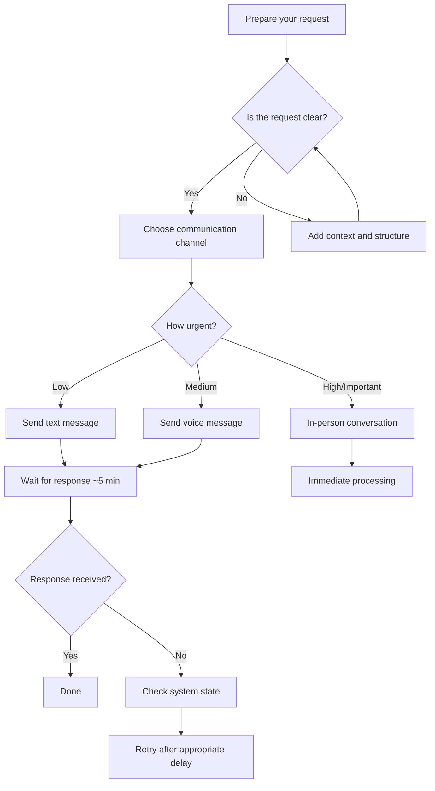

# Getting Started

This guide covers the prerequisites, initial configuration, and recommended interaction patterns for working with the Anastasia system.

## Prerequisites

Before initiating interaction, ensure the following conditions are met:

- [x] Your request is clearly defined
- [x] Sufficient context is provided for non-trivial tasks
- [x] Your tone is respectful and diplomatic
- [x] The system is not in `OFFLINE` or `PROCRASTINATING` state
- [x] Current time is within operational hours (10:00 — 21:00 recommended)

!!! warning "Critical Prerequisite"
    Verify that the system has received adequate food input. Interaction with a hungry system may result in a `503 Service Unavailable` error. See [Error Handling](error-handling.md) for details.

## Boot Sequence

The system follows a strict initialization procedure each morning. Do **not** attempt interaction during boot, as the system is not fully operational until the sequence completes.

```
┌─────────────────────────────────────┐
│         BOOT SEQUENCE               │
├─────────────────────────────────────┤
│ 1. Wake up                          │
│ 2. Scroll news feed      [~10 min]  │
│ 3. Wash face, brush teeth [~10 min] │
│ 4. Breakfast              [~15 min] │
│ 5. Watch one episode of   [~25 min] │
│    favorite series                  │
│ 6. System READY                     │
├─────────────────────────────────────┤
│ Total estimated boot time: ~60 min  │
│ Do not interrupt this process.      │
└─────────────────────────────────────┘
```

!!! note
    Interrupting the boot sequence (especially steps 4-5) may result in degraded performance for the remainder of the day.

## First Interaction

### Recommended Flow



### Input Format

For optimal processing, structure your request as follows:

```
[CONTEXT]   — Background information or relevant details
[TASK]      — Clear description of what you need
[OUTPUT]    — Expected format or result (optional)
```

**Example — Good Request:**

> **Context:** We have a group project due next week for the Game Development course.  
> **Task:** Could you please review the physics engine module and suggest improvements?  
> **Output:** A list of specific changes with priority levels.

**Example — Bad Request:**

> hey do the thing

This will return a `400 Bad Request`. See [Error Handling](error-handling.md).

## Communication Channel Selection

| Channel               | Best For                          | Response Time |
|-----------------------|-----------------------------------|---------------|
| Text message          | General questions, simple tasks   | ~5 minutes    |
| Voice message         | Medium-complexity requests        | ~10 minutes   |
| In-person             | Important or sensitive topics     | Immediate     |

!!! tip "Pro Tip"
    Including "please" and "thank you" in your request is not optional — it is a **protocol requirement**. Omitting these keywords may result in reduced response priority.

## Quick Start Example

```python
# Step 1: Verify system availability
if anastasia.state not in ["OFFLINE", "PROCRASTINATING"]:
    
    # Step 2: Prepare input
    request = {
        "context": "Need help with the UI for our game project",
        "task": "Design the main menu layout",
        "tone": "polite",
        "includes_please": True
    }
    
    # Step 3: Optional performance boost
    request.add_incentive("chocolate_cake")
    
    # Step 4: Send request
    response = anastasia.communicate(request)
    
    # Step 5: Process response
    print(response)  # Structured answer with optional humor layer
```

## Next Steps

- Review the full [Communication API](communication-api.md) for all supported methods
- Understand [System States](system-states.md) to optimize your interaction timing
- Familiarize yourself with [Error Handling](error-handling.md) to avoid common pitfalls
