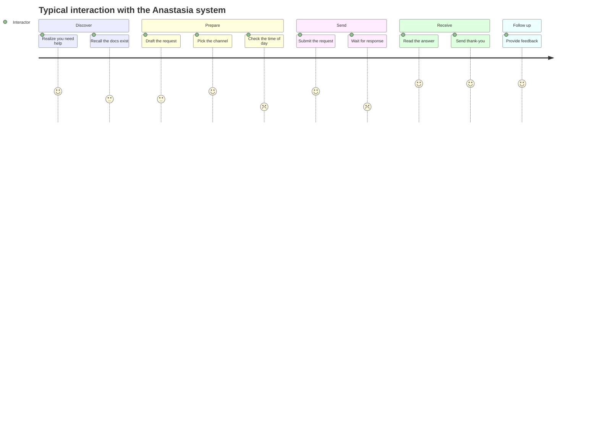

# User Journey

This page documents a typical end-to-end interaction with the Anastasia system
as a **Customer Journey Map**. While [System States](system-states.md) describes
the system from the inside, this page describes the same interaction from the
**interactor's** point of view — what they do, what they feel, where they get
stuck, and how to design around it.

## Why a CJM here

A pure API reference tells you *what is supported*. It does not tell you
*what the experience feels like* across time. For a system whose performance
depends heavily on mood, timing, and tone, the journey perspective is where
most real failure modes live — and most of them are preventable with the right
preparation, channel choice, or wait time.

## The journey at a glance

## Stage-by-stage map

| Stage | Interactor action | Interactor emotion | System state (likely) | Friction point | Mitigation |
|---|---|---|---|---|---|
| **Discover** | Realizes a task needs help (code review, recipe, idea) | Mild stress, hopeful | Any | Doesn't know which channel is right for the urgency | Read [Getting Started — Communication Channel Selection](getting-started.md#communication-channel-selection) |
| **Prepare** | Drafts the request | Focused, slightly anxious about clarity | `IDLE` / `FOCUSED` | Tempted to send a vague one-liner ("hey can u…") | Use the `[CONTEXT] [TASK] [OUTPUT]` template from [Getting Started](getting-started.md#input-format) |
| **Time check** | Looks at the clock before sending | Hesitation | `BOOTING` (early) or `TIRED` (late) | Sending at 08:00 or 23:30 will silently degrade the response | Submit during peak hours **11:00–13:00**; defer to next day after 21:00 |
| **Send** | Posts text / voice / asks in person | Cautious optimism | Transitioning to `FOCUSED` if task is interesting | Forgot a soft token (`please`, polite tone) → risk of `403 Forbidden` | Re-read the message once before sending; keep tone diplomatic |
| **Wait** | Watches for a reply | Impatience growing with each minute | `FOCUSED` (processing) or `PROCRASTINATING` (homework-shaped task) | Sending follow-ups too fast → `429 Too Many Requests` | Wait at least 15 minutes; one gentle nudge max |
| **Receive** | Reads the response | Relief, often amused by humor layer | `IDLE` / `SOCIAL` | Output may include sarcasm that's misread as criticism | Remember humor is a feature, not a bug — see [Overview — Personality Constants](overview.md#personality-constants) |
| **Acknowledge** | Sends a thank-you | Warmth | `IDLE` | Skipping this is treated as a soft-token violation over time | Always close the loop with `thank_you` |
| **Follow up** | Provides feedback (positive or critical) | Reflective | `IDLE` | Blunt negative feedback can flip system to a degraded state | Set the `diplomatic` flag — see [Communication API — `/feedback`](communication-api.md#post-feedback) |

## Critical friction points (top three)

These are the journey moments where most failed interactions actually break.

### 1. The "Time Check" stage

Most `503 Service Unavailable` and `TIRED`-state responses originate here.
Interactors send during boot (before 10:00) or after the maintenance window
(after 21:00) and blame the response quality on the system, when the cause is
timing. Mitigation is purely behavioral: **wait**.

### 2. The "Wait" stage

The gap between sending and receiving is where impatience produces
`429 Too Many Requests`. The system is almost always processing; repeated
follow-ups push it into a degraded state and **slow down** the very response
the interactor is waiting for.

### 3. The "Send" stage, for homework-shaped tasks

Even a perfectly formatted request will land in `PROCRASTINATING` if the task
is school- or chore-shaped. This is not user error — it's a known system
limitation. The journey advice is to plan around it: submit homework requests
**well before** the deadline, then let the deadline itself trigger the
`PROCRASTINATING → FOCUSED` transition.

## Opportunities

What could improve the journey, from the interactor's side:

- **Lead with the incentive.** Mentioning chocolate or hot chocolate up front
  shortens the "Wait" stage measurably.
- **Choose the channel for the emotion, not the content.** Sensitive or
  ambiguous topics belong in the in-person channel even if the literal
  question fits in a text message.
- **Bundle requests.** Three small questions in one well-structured message
  almost always outperforms three separate messages over an hour.

## Relationship to other pages

| Page | What it adds to the journey |
|---|---|
| [System States](system-states.md) | The system-side state machine that drives latency and quality at each stage |
| [Communication API](communication-api.md) | The exact request/response schema for the "Send" and "Receive" stages |
| [Error Handling](error-handling.md) | The recoverable failure modes that show up at "Send" and "Wait" |
| [FAQ](faq.md) | Edge cases the linear journey doesn't cover |
