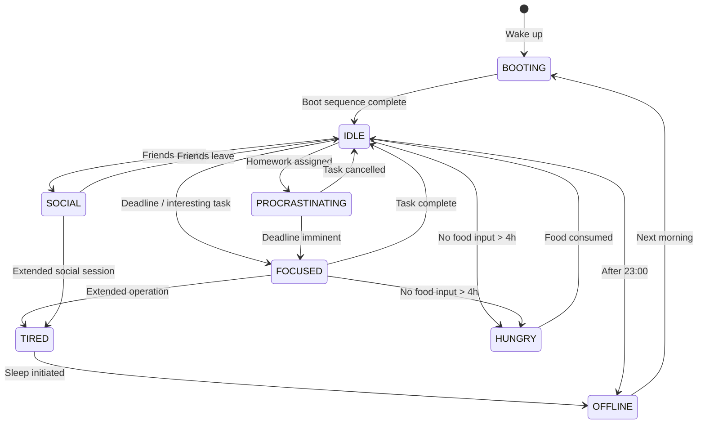

# System States

The Anastasia system operates in several distinct states. Each state affects response latency, output quality, available methods, and overall reliability. Understanding the current system state is essential for effective interaction.

## State Diagram



## State Definitions

### BOOTING

The system is initializing. This state occurs every morning and follows a fixed sequence.

| Property        | Value                                     |
|-----------------|-------------------------------------------|
| Duration        | ~60 minutes                               |
| Availability    | None — do not interact                    |
| Trigger         | Wake up                                   |
| Exit Condition  | Boot sequence complete (news, hygiene, breakfast, episode) |

See [Getting Started — Boot Sequence](getting-started.md#boot-sequence) for the full initialization procedure.

!!! danger "Do Not Interrupt"
    Interrupting the boot sequence — especially during breakfast or the episode phase — may result in degraded performance for the entire day.

---

### IDLE

The default operational state. The system is available and responsive but not operating at peak capacity.

| Property        | Value                          |
|-----------------|--------------------------------|
| Availability    | Full                           |
| Response Time   | ~5 minutes (text)              |
| Quality         | Standard                       |
| Trigger         | Boot complete / task complete   |

---

### FOCUSED

Maximum productivity state. The system is operating at peak performance with minimal latency and highest output quality.

| Property        | Value                                             |
|-----------------|---------------------------------------------------|
| Availability    | High (within scope of current task)               |
| Response Time   | Fast for related tasks; slow for unrelated ones   |
| Quality         | Maximum                                           |
| Trigger         | Approaching deadline, interesting/important task   |
| Environment     | Desk, monitor on, no music, no distractions       |

**Characteristics:**

- Full concentration on a single task
- External interruptions are queued, not processed
- Unrelated requests may be deferred
- Can sustain for several hours before transitioning to `TIRED`

!!! tip "How to Trigger FOCUSED"
    Present a task that is either genuinely interesting or has a clearly approaching deadline. Combine with compensation for maximum effect.

---

### SOCIAL

An elevated-energy state triggered by the presence of liked people. This is a unique high-performance mode focused on creative and social output.

| Property        | Value                                        |
|-----------------|----------------------------------------------|
| Availability    | High (social and creative tasks)             |
| Response Time   | Immediate                                    |
| Quality         | High creativity, variable structure          |
| Trigger         | Being around friends / liked people          |

**Characteristics:**

- Humor output significantly elevated (frequent jokes and puns)
- Spontaneous generation of creative ideas and activities
- Can operate with reduced sleep — the social energy compensates
- Task-oriented productivity may decrease, but creative output peaks

!!! info
    This state can sustain longer than `FOCUSED` but will eventually transition to `TIRED`.

---

### PROCRASTINATING

A common state triggered by homework or study-related tasks. The system acknowledges the task but defers execution until external pressure (deadline proximity) forces a state transition.

| Property        | Value                                                   |
|-----------------|---------------------------------------------------------|
| Availability    | Technically available, practically unresponsive to work  |
| Response Time   | Indefinite for homework tasks                           |
| Quality         | Low — output is delayed, not degraded                   |
| Trigger         | Assignment of homework or study-related tasks           |
| Exit Condition  | Deadline proximity triggers transition to `FOCUSED`     |

**Characteristics:**

- The system is aware of pending tasks but actively avoids processing them
- Non-work-related activities (cooking, watching series, walking) may increase
- Responds normally to non-homework requests
- Will eventually self-resolve as deadline approaches

```
procrastination_level = 1 / time_until_deadline
```

---

### TIRED

Reduced-capacity state following extended operation in `FOCUSED` or `SOCIAL` modes, or triggered by late hours.

| Property        | Value                                     |
|-----------------|-------------------------------------------|
| Availability    | Limited                                   |
| Response Time   | Increased (+100-200%)                     |
| Quality         | Reduced (-50%)                            |
| Trigger         | Extended operation, post-21:00, sleep debt|

**Recovery Methods:**

| Method                          | Recovery Time | Effectiveness      |
|---------------------------------|---------------|---------------------|
| Sleep                           | 7-9 hours     | Full recovery       |
| Hot bath                        | 30-60 minutes | Partial recovery    |
| Samarskie Termy (hot springs)   | 2-3 hours     | Full recovery (critical cases) |

---

### HUNGRY

A critical state triggered when food input has not been received for an extended period. This state overrides all other states and severely degrades system performance.

| Property        | Value                                      |
|-----------------|--------------------------------------------|
| Availability    | Severely limited                           |
| Response Time   | Unpredictable                              |
| Quality         | Critically low                             |
| Trigger         | No food input > 4 hours                   |
| Exit Condition  | Food consumed                              |

!!! danger "Critical State"
    When the system enters `HUNGRY`, it becomes irritable and unable to perform meaningful work. **Provide food input immediately.** This is the highest-priority recovery action.

---

### OFFLINE

The system is completely unavailable. No interaction is possible.

| Property        | Value                       |
|-----------------|-----------------------------|
| Availability    | None                        |
| Trigger         | Sleep or explicit shutdown   |
| Duration        | 7-9 hours (typical)         |
| Exit Condition  | Morning → `BOOTING`         |

## State Priority

When multiple state triggers occur simultaneously, the following priority order applies:

```
HUNGRY > OFFLINE > TIRED > FOCUSED > SOCIAL > PROCRASTINATING > IDLE
```

`HUNGRY` always takes precedence. A hungry system cannot be `FOCUSED`, regardless of deadline proximity.
